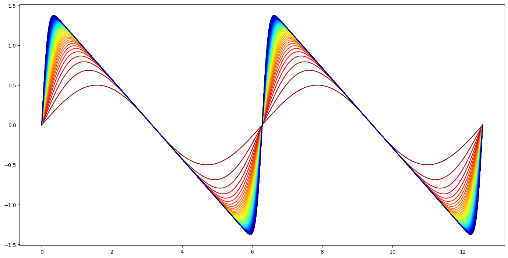

# Saw Tooth Wave Generator
A small script to generate and plot a given number of "saw tooth waves".
The code is based on [this stackoverflow question](https://math.stackexchange.com/q/2430564/695640), and is implemented based on [this answer](https://math.stackexchange.com/a/2431811/695640).

